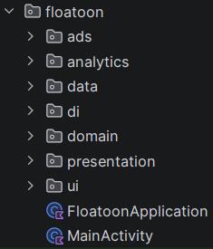
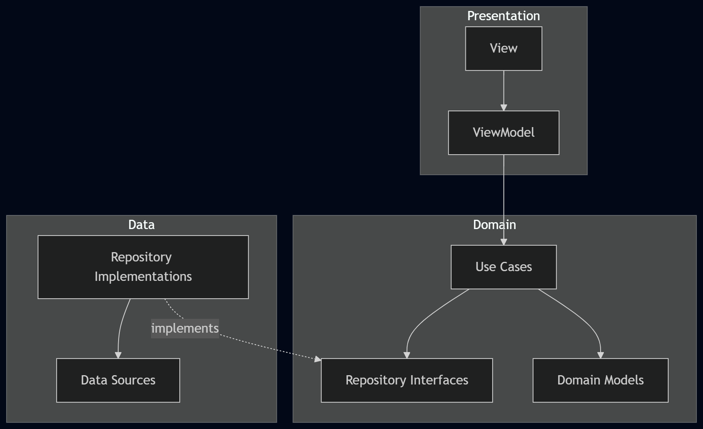
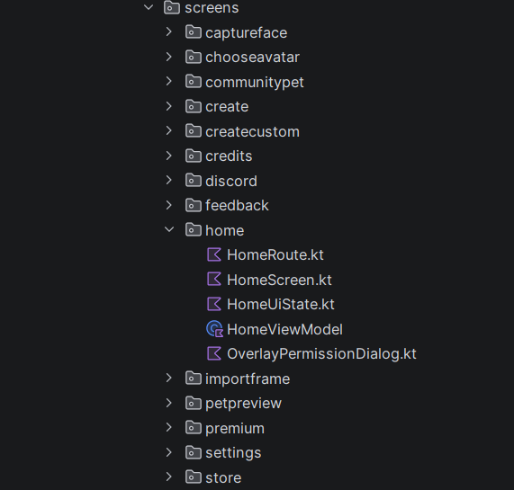
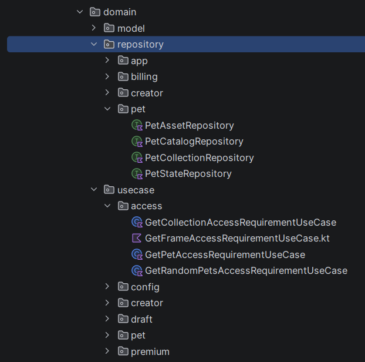
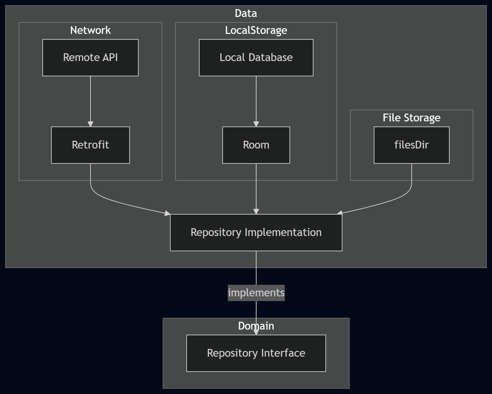
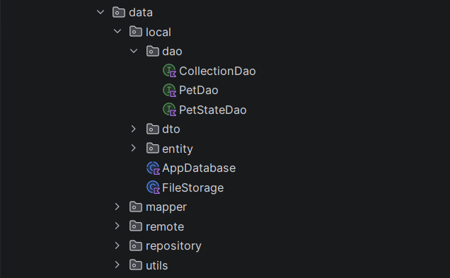
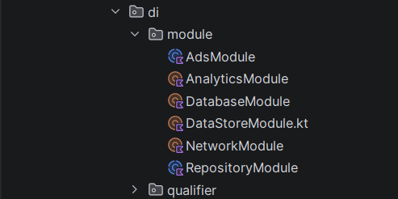
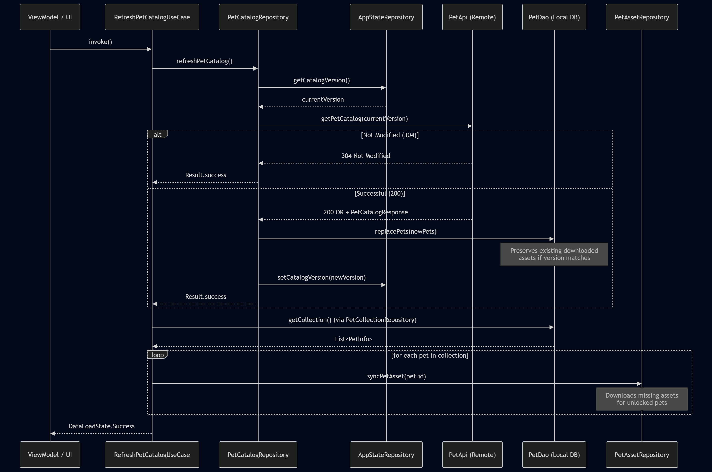
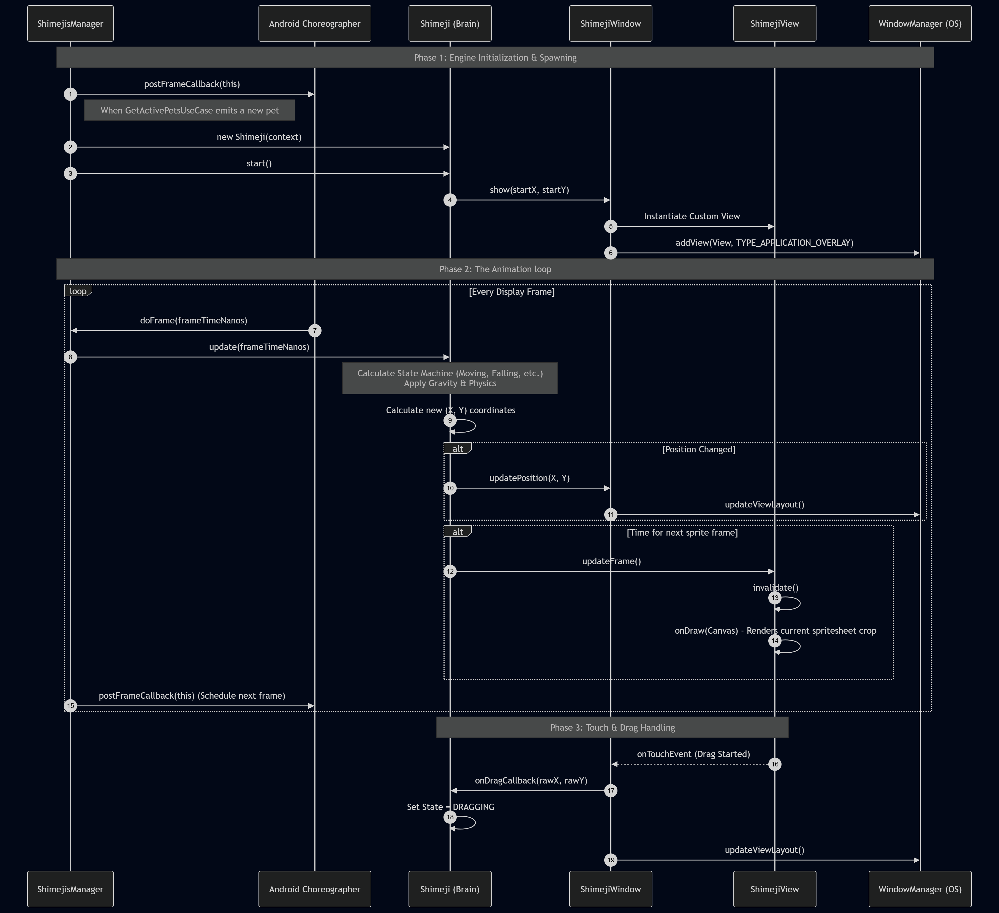

# Floatoon

A Kotlin-based Android virtual pet application published on Google Play,
with **200,000+ downloads**.

This repository is a **sanitized technical showcase** of the production application.
It demonstrates how the project is structured using **Clean Architecture
and MVVM**, and highlights engineering solutions, including a **custom rendering engine via system-level overlays**, **on-device machine learning (ML Kit)**, and strategies for **memory management and geo-routed monetization**.

> **Note:** The complete production source code is not included in this
> repository. The code samples, architecture diagrams, and technical breakdowns provided here have been specifically selected
> for technical evaluation.

## Table of Contents
- [Highlights](#highlights)
- [What This Repository Demonstrates](#what-this-repository-demonstrates)
- [Production Application](#production-application)
- [Architecture](#architecture)
  - [Dependency Flow](#dependency-flow)
  - [Presentation Layer](#presentation-layer)
  - [Domain layer](#domain-layer)
  - [Data Layer](#data-layer)
  - [Dependency Injection](#dependency-injection)
- [Technical Highlights](#technical-highlights)
  - [Pet Catalog System](#pet-catalog-system)
  - [System-Level Overlays (Virtual Pet Engine)](#system-level-overlays-virtual-pet-engine)
  - [On-Device Machine Learning (Intelligent Face Capture)](#on-device-machine-learning-intelligent-face-capture)
- [Challenges & Solutions](#challenges--solutions)
  - [1. Geo-Routed Ad Monetization (Bypassing AdMob Restrictions)](#1-geo-routed-ad-monetization-bypassing-admob-restrictions)
  - [2. Content Sharing (.vpet Files)](#2-content-sharing-vpet-files)
  - [3. Preventing OOM Crashes via Dynamic Spritesheet Generation](#3-preventing-oom-crashes-via-dynamic-spritesheet-generation)
- [Code sample](#code-sample)

## Highlights

- **200,000+ Google Play downloads**
- Built with **Kotlin** and **Jetpack Compose**
- Clean Architecture
- MVVM
- Dependency Injection
- Coroutines / Flow
- Retrofit
- Offline first implementation
- Custom pet behavior and animation system
- Android overlay functionality
- Persistent application state

## What This Repository Demonstrates

This showcase focuses on the engineering behind the application:

- **Clean Architecture & MVVM:** Separation of concerns across Presentation, Domain, and Data layers.
- **Dependency Injection:** Cleanly managing components and dependencies using Hilt.
- **Advanced Android Integrations:** Practical usage of System-Level Overlays, CameraX, and MediaStore.
- **On-Device Machine Learning:** Utilizing ML Kit for real-time face detection.
- **Performance Optimization:** Handling dynamic assets efficiently to prevent memory issues.
- **Complex Problem Solving:** Applying design patterns to overcome real-world production challenges.

## Production Application

The application is available on Google Play:

**[Google Play - Floatoon](https://play.google.com/store/apps/details?id=com.tesseractplay.floatoon)**

The production application and this showcase repository are separate.
This repository contains selected and sanitized material from the
production project for technical evaluation.

## Architecture

The application follows Clean Architecture with MVVM.

The project is divided majorly into **Presentation**, **Domain**, **DI** and **Data** layers. The *Ads* and *Analytics* are separated neatly from other layers.

### Dependency Flow

Presentation → Domain ← Data

The Presentation layer depends on the Domain layer, while the Data layer
provides implementations of the abstractions defined by the Domain layer.

The application follows the Model–View–ViewModel (MVVM) pattern to separate UI presentation from application logic and state management.

### Presentation Layer

Each navigation route provides its corresponding ViewModel to the screen, keeping the screen layer focused purely on UI rendering and interaction. This separation makes the screens reusable, testable, and easy to preview with mock state, enabling seamless Jetpack Compose Previews.

*A typical presentation module is structured like below*

### Domain layer

The **Domain layer** contains the core business logic of the application and is independent of Android-specific frameworks and UI concerns.

It defines **use cases, domain models, and repository contracts**, keeping business rules isolated from how data is stored or presented.

Each use case represents a specific business operation and exposes a clear API to the Presentation layer. Repository interfaces are defined within the Domain layer, while their implementations are provided by the Data layer.

This follows the **Dependency Inversion Principle**, keeping the business logic independent of specific data sources and implementation details.

### Data Layer

The **Data layer** is responsible for handling data retrieval, persistence, and communication with external data sources. It acts as the implementation layer for the repository contracts defined by the Domain layer.

For networking, the application uses **Retrofit** to communicate with remote APIs. For local persistence, **Room** is used to store and retrieve application data from the local database.

The Data layer abstracts these implementation details from the Domain and Presentation layers, allowing the rest of the application to work with domain-level abstractions rather than directly interacting with Retrofit or Room.

#### Data Flow

*Data layer is strcutured as below:*

### Dependency Injection

The application uses **Hilt** for dependency injection, providing dependencies
throughout the application while keeping components loosely coupled.

The DI layer is responsible for constructing and wiring the application's
dependencies, including repositories, use cases, networking components,
database components, and other required services.

## Technical Highlights

### Pet Catalog System

The catalog refresh process is managed by `RefreshPetCatalogUseCase` and follows a version-controlled, bandwidth-efficient sync strategy:
> **Note on Terminology**: In the codebase, this is referred to as the user's **"Collection"** (e.g., `getCollection()`), but in the user interface, these are presented to the user as their **"Active pets"**.
1. **Version Check**: The `PetCatalogRepository` retrieves the currently cached `catalogVersion` from local storage (`AppStateRepository`).
2. **Network Request**: It sends a request to the `PetApi`, passing the current version to check for updates.
3. **Caching & Database Update**:
   - **Not Modified (304)**: If the server determines the catalog hasn't changed, the update is skipped.
   - **Success (200)**: If new data is available, the repository replaces the local catalog in the `PetDao`. This intelligently preserves the file paths of already-downloaded assets if their asset versions haven't changed. The new `catalogVersion` is then saved.
4. **Asset Synchronization**: Once the catalog is up-to-date, the system retrieves the user's pet collection (Active pets) and triggers `PetAssetRepository` to asynchronously download any missing assets for the pets they added to the Active pets so that users don't have to download the pets manually for which they already use.

### System-Level Overlays (Virtual Pet Engine)

Built a custom "Shimeji" rendering engine that breaks out of the standard application to display interactive virtual pets over any screen on the device. This required working with advanced Android OS components rather than standard UI frameworks. 
Key technical implementations include:
*   **Foreground Service & WindowManager:** Utilized a persistent Foreground Service linked to the Android `WindowManager` with `TYPE_APPLICATION_OVERLAY` permissions to render views globally across the operating system.
*   **Battery Optimization:** Implemented a custom `BroadcastReceiver` that tracks hardware `ACTION_SCREEN_OFF` and `ACTION_SCREEN_ON` events. This ensures the rendering engine instantly pauses all animation loops when the device goes to sleep, drastically reducing battery drain.
*   **User Control:** Integrated a custom Notification Channel that acts as a persistent controller, allowing users to play or pause the engine directly from their system tray without needing to open the app.
*   **ShimejisManager**: The orchestrator. It listens to user settings (size, speed, ghost mode) and active pet databases, managing the lifecycle of all pets on screen and driving the main time loop via `Choreographer`.

### On-Device Machine Learning (Intelligent Face Capture)
Built an intelligent camera interface that allows users to capture their face for custom pet creation. This feature tightly integrates Android hardware APIs with edge AI to ensure high-quality, validated inputs without relying on backend servers.

**Key Technical Implementations:**
*   **Hardware Integration (CameraX):** Utilizes Android's CameraX library to simultaneously stream frames from the front-facing camera to a live UI `PreviewView` and a background image analysis pipeline.
*   **Real-Time Edge AI (ML Kit):** Feeds live camera frames into Google's ML Kit `FaceDetection` client. This drives reactive UI states, providing instant visual feedback (e.g., turning the camera border green) the moment a user's face enters the frame.
*   **Bitmap Transformation Matrix:** Automatically processes the raw high-resolution capture by applying a hardware Matrix transformation to rotate and horizontally mirror the Bitmap, ensuring the final image matches the user's expected perspective.
*   **Strict Validation Pipeline:** Enforces strict validation rules in the ViewModel by running a final ML Kit inference pass on the captured still image. It actively rejects captures with zero faces or multiple faces, guaranteeing a clean asset for the avatar generation pipeline.

## Challenges & Solutions

### 1. Geo-Routed Ad Monetization (Bypassing AdMob Restrictions)
**The Challenge:**
Due to ongoing international sanctions, Google AdMob suspended ad serving to users located in Russia. This resulted in a complete loss of monetization for a significant segment of the user base. I needed a way to serve alternative ads (via Unity Ads) to Russian users while continuing to serve higher-paying AdMob ads to the rest of the world, without cluttering the UI code with complex conditional logic.

**The Solution:**
I implemented a Geo-Routing system utilizing the **Strategy and Proxy Design Patterns** to seamlessly swap ad providers at runtime based on the user's location.
*   **Unified Interface:** I created a generic `AdsManager` interface defining standard ad operations (`initialize`, `loadAd`, `showAd`) and implemented it with both an `AdMobAdsManager` and a `UnityAdsManager`.
*   **Intelligent Geo-Detection:** I created a `GeoRoutedAdsManager` that acts as a proxy. It determines the user's physical location by first checking the SIM card's network country via `TelephonyManager.networkCountryIso` (which is highly accurate and hard to spoof). If unavailable, it falls back to the device's `Locale`.
*   **Lazy Delegation:** If the country code is resolved as "RU", the `GeoRoutedAdsManager` lazy-loads and delegates all ad requests to Unity Ads. For all other regions, it routes to AdMob.
*   **Clean Architecture:** By leveraging Dagger Hilt for Dependency Injection, the entire application simply requests the generic `AdsManager` interface. The UI and Domain layers remain 100% oblivious to which ad network is actually serving the ad, adhering strictly to the Open-Closed Principle.

### 2. Content Sharing (.vpet Files)
**The Challenge:**
To increase the app's network effects, users needed a way to easily share the custom pets they created with their friends outside of the app ecosystem (e.g., via WhatsApp, Discord). However, a virtual pet consists of hundreds of individual image frames and complex JSON metadata, making raw sharing impossible.

**The Solution:**
I engineered a proprietary, transportable file format (`.vpet`) paired with an intelligent import/export engine that handles data migration on the fly.
*   **The `.vpet` Standard:** I encapsulated the entire pet directory (JSON metadata, spritesheets, thumbnails) into a standardized ZIP archive, renaming the extension to `.vpet`. This gave users a single, easily recognizable file that chat apps could handle effortlessly.
*   **Scoped Storage Export:** I utilized Android's `MediaStore` API to securely write the `.vpet` file directly to the user's public `Downloads` folder. This avoided the need to ask for invasive `MANAGE_EXTERNAL_STORAGE` permissions, ensuring a smooth UX and compliance with modern Android privacy policies.
*   **Intelligent Import:** When a user imports a `.vpet` file, the `CustomPetRepositoryImpl` parses the zip structure. 
*   **Result:** This guaranteed that any `.vpet` file ever created by the community would continue to work flawlessly on the latest app version, completely abstracting the technical complexity away from the user and heavily boosting organic sharing.

### 3. Preventing OOM Crashes via Dynamic Spritesheet Generation

**The Challenge:**
The application allows users to draw or import their own custom virtual pets. These pets can have multiple complex states (walking, climbing, falling, interacting) requiring multiple image frames. Loading and holding tens of individual `Bitmap` objects in memory simultaneously would cause severe heap fragmentation and `OutOfMemoryError` (OOM) crashes on Android, while also dropping frames in the physics engine.

**The Solution:**
To guarantee a smooth physics overlay while maintaining a minimal memory footprint, I engineered an automated, on-device spritesheet generation pipeline.

*   **Algorithmic Grid Packing:** When a user finishes creating a custom pet, the `CustomPetRepositoryImpl` intercepts the raw drawn frames. It uses a square-root heuristic to calculate an optimal 2D grid matrix, seamlessly stitching all individual frames for a given animation state into a single, consolidated Spritesheet `Bitmap`.
*   **Hardware-Accelerated Cropping:** The rendering engine (`ShimejiView`) is designed to hold only these few optimized spritesheets in memory. On every tick of the `Choreographer`, it simply updates a `Rect` (Source Rectangle) coordinate window. It uses Android's highly optimized, hardware-accelerated `Canvas.drawBitmap(sheet, srcRect, dstRect)` API to instantly crop and render the correct frame.
*   **Proactive Resolution Capping:** I implemented a bilinear scaling algorithm. When users upload custom photos or draw oversized frames, the system proactively scales them down to a strict memory budget (e.g., 256px) *before* they are processed. This ensures the final generated spritesheet never exceeds Android's safe OpenGL texture size limits.

## Code Sample

This repository includes a `code-sample` directory showcasing the separation of concerns across different layers and feature modules. The provided examples focus on the Pet Catalog synchronization feature in the community pets screen, along with the Geo-Routed Ad Monetization and Analytics systems:

### Domain Layer (`code-sample/domain/`)
- **`repository/PetCatalogRepository.kt`**: Defines the interface contract for pet catalog data operations, ensuring the business logic remains decoupled from the specific data source (e.g., local database or remote API).
- **`usecase/RefreshPetCatalogUseCase.kt`**: Encapsulates the core business logic for refreshing the catalog. It handles network requests via the repository, triggers subsequent asset synchronization for the user's active pets, and exposes a robust `DataLoadState` using Kotlin `StateFlow` to communicate progress and errors.

### Presentation Layer (`code-sample/presentation/`)
- **`CommunityPetViewModel.kt`**: A Hilt-injected ViewModel that connects the Domain and UI layers. It reactively combines data from `PetCatalogRepository` and `RefreshPetCatalogUseCase` into a single `StateFlow` representing the screen's state, keeping the UI completely oblivious to data retrieval mechanics.
- **`CommunityPetUiState.kt`**: A Kotlin data class representing the immutable UI state for the Community Pets screen, demonstrating unidirectional data flow.

### Ads Module (`code-sample/ads/`)
- **`AdsManager.kt`**: A unified interface defining standard ad operations (`initialize`, `loadAd`, `showAd`).
- **`impl/GeoRoutedAdsManager.kt`**: A proxy implementation that dynamically routes ad requests to different providers based on the user's network location.
- **`impl/AdMobAdsManager.kt` / `impl/UnityAdsManager.kt`**: Concrete implementations for their respective ad networks.

### Analytics Module (`code-sample/analytics/`)
- **`api/AnalyticsLogger.kt`**: An interface contract for logging application events, ensuring the app isn't tightly coupled to a specific analytics SDK.
- **`impl/FirebaseAnalyticsLogger.kt` / `impl/DebugAnalyticsLogger.kt`**: Concrete implementations for production (Firebase) and development (Logcat debugging).
